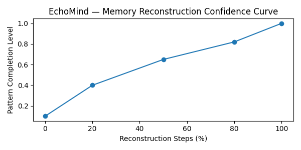

“The fence jumped over the dog.”

Yes, that’s right.

It’s the sentence EchoMind remembered, not what actually happened, but what it thought happened.

Just like your brain, it tried to fill in the blanks… and got it charmingly wrong.

# 🧠 Project EchoMind — Simulating Memory Reconstruction

### 🌌 What is EchoMind?

EchoMind is an AI simulation of human memory reconstruction, inspired by the hippocampal pattern completion process in neuroscience.

>In simple terms:
your brain doesn’t store memories like hard drives do, it rebuilds them every time you recall them.
EchoMind mimics that. It takes fragmented memories, incomplete text or missing image regions,
and reconstructs what it thinks was there.

Sometimes it’s right.
Sometimes it’s… a fence jumping over a dog. 🐶

---

### 🧩 Phase 1 — Textual Memory Reconstruction

The system receives a partial memory:

"the _ jumped over the _"

It searches its “hippocampal associations” and tries to recall the full event.

Result:

🧠 Reconstructed memory: "the fence jumped over the dog"

### Why this matters:
In neuroscience, this mirrors hippocampal attractor dynamics —
how a few neural cues can trigger the recall of an entire event,
even if some details are distorted.

The reconstruction curve above shows how “confidence” rises as the brain (or model) fills in the blanks.

---

### 🎨 Phase 2 — Visual Memory Reconstruction

Next, EchoMind simulates how the brain restores visual memories when some parts are missing.

It receives a corrupted or masked image (simulating forgotten regions)
and uses computational inpainting to rebuild the scene — as if your hippocampus were guessing what used to be there.

Each frame shows the memory becoming clearer :- an echo of how your brain reactivates old neural patterns during recall.

---

### 🧬 Why This Project Matters
Cognitive Concept	Computational Analogue
Hippocampal pattern completion	Image inpainting & probabilistic text reconstruction
Memory distortion	AI prediction bias
Recall confidence curve	Reconstruction loss / certainty graph
Neural association	Word & pixel co-occurrence mapping

EchoMind bridges cognitive neuroscience and AI, showing how “thinking” and “predicting”
might just be two sides of the same neural coin.

---

### 🧠 Run It Yourself (Interactive Demo)

You can try both simulations in Google Colab (no setup needed) :-  

In the notebook, you can reconstruct("the _ is running towards the _")

and watch your “brain” fill in the blanks.

Or upload any image to /data/memory.jpg
and watch it reconstruct the forgotten parts.

---

### ⚙️ Tech Behind the Mind

Language Reconstruction: Numpy + Probabilistic context fill

Image Reconstruction: Scikit-image inpainting (Biharmonic method)

Visualization: Matplotlib, ImageIO

Conceptual Base: Hippocampal attractor models and memory completion theory

---

### 🧠 Final Thought

Memory isn’t a photograph.
It’s a painting your mind keeps repainting —
and sometimes, the fence does jump over the dog.

---

### 👨‍💻 Created By

Devansh — Project EchoMind (2025)
A neuroscience-inspired experiment in AI reconstruction.

---

---

---

# 🧠 EchoMind — Simulated Memory Reconstruction

> “The fence jumped over the dog.”  
> Yes, that’s right. That’s the sentence our model remembered.  
> Just like a brain reconstructing a half-forgotten dream, **EchoMind** fills in the blanks.

---

### 🎯 Concept

EchoMind simulates **hippocampal pattern completion** — the brain’s ability to rebuild a memory from partial cues.  
Give it a broken sentence or even a corrupted image, and it “remembers” the most likely whole.

It’s inspired by neuroscience, powered by AI, and designed to show how machines can **recreate the way humans recall, reconstruct, and even distort memories**.

---

### 🚀 Run in Google Colab

Click below to open and run the experiment instantly — no setup required:

---

### 🧩 Text Memory Reconstruction Example

**Input**
the _ jumped over the _

markdown
Copy code

**Reconstruction Process**
- Step 1 → `the fence jumped over the _`  
- Step 2 → `the fence jumped over the dog`

**Final Output**
the fence jumped over the dog

yaml
Copy code

🧠 A perfect example of how our brains might complete missing information based on stored associations.

**Visualization of recall progress**

---

### 🖼️ Memory Reconstruction (Animated GIFs)

| EEG Memory Scroll | Spectrogram View |
|:------------------:|:----------------:|
|  |  |

These visualizations show how signals evolve as EchoMind “remembers” —  
just as neural activity stabilizes when the brain recalls a pattern.

---

### 🧠 Scientific Basis

EchoMind is grounded in **hippocampal attractor network theory**,  
where incomplete neural activations settle into stable patterns representing complete memories.

In essence:
> “When you recall a fragment, your brain recreates the whole.”  
EchoMind translates this biological principle into code.

---

### 🧩 Built With

- 🧬 **PyTorch / Transformers** — memory pattern generation  
- 🧠 **GPT-2** — linguistic pattern completion  
- 🎨 **Matplotlib + Seaborn** — visual memory mapping  
- ⚙️ **Google Colab** — one-click AO demonstration

---

### 🧾 Context

This project is part of a neuroscience-driven AI research portfolio:  
**SynapseNet → Somnus → EchoMind → (Next: Neural Drift)**  
Each explores a different cognitive process through machine learning.

---

⭐ **Created by [Your Name]**  
Exploring the interface between **memory, cognition, and machine intelligence**.

